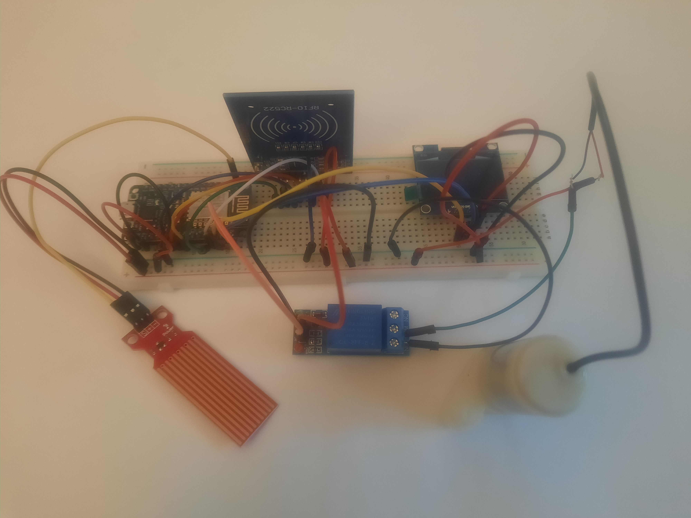
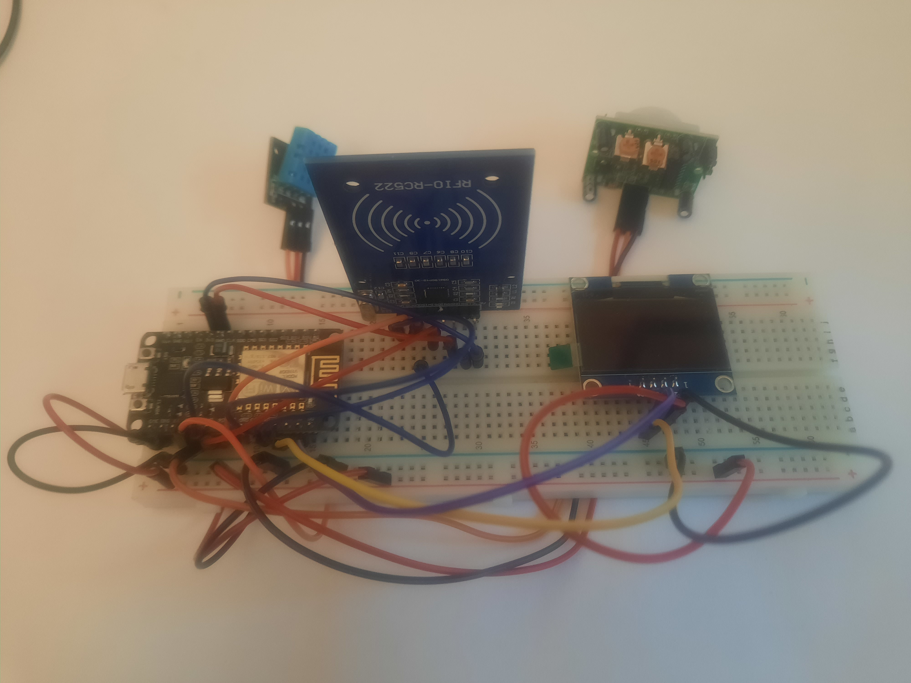

# Hydro Shepherd 💧

An IoT-based hydration monitoring and dispensing system designed for assisted living facilities.

See the following post for futher detail - https://yehudataylor.com/posts/hydro-shepherd/


## The Problem

Residents in assisted living facilities face serious hydration challenges:

- **Dehydration** is common among elderly residents and can lead to hospitalisation, cognitive decline, and increased mortality
- **Overhydration** (water toxicity) is a risk for residents with dementia who may not remember how much they've consumed
- Existing solutions require expensive proprietary containers, can't accurately track consumption, and raise privacy concerns with camera-based monitoring

## The Solution

Hydro Shepherd is a distributed IoT system that:

- Dispenses water into **any container** (no proprietary bottles needed)
- Tracks individual consumption via **RFID tags** (cheap, scalable, privacy-preserving)
- Adjusts recommendations based on **environmental conditions** (temperature/humidity sensors)
- Provides **real-time dashboards** for healthcare staff
- Prevents both under- and over-hydration through consumption limits

## Hardware

### Dispenser Node
The water dispensing station identifies users and dispenses measured amounts of water.



### Server Node
The central server tracks environmental conditions and manages user data.



## System Architecture

```
┌─────────────────────┐         ┌─────────────────────┐
│   Dispenser Node    │◄──────► │   Server Node       │
│                     │  REST   │                     │
│  • RFID Reader      │   API   │  • Temp/Humidity    │
│  • Water Pump       │         │  • Motion Sensor    │
│  • Level Sensor     │         │  • User Management  │
│  • OLED Display     │         │  • OLED Display     │
└─────────────────────┘         └─────────────────────┘
           │                              │
           └──────────┬───────────────────┘
                      ▼
              ┌───────────────┐
              │   Firebase    │
              │   Realtime    │
              │   Database    │
              └───────────────┘
```

## Hardware Components

| Component | Purpose |
|-----------|---------|
| NodeMCU ESP8266 (x2) | Microcontrollers for both nodes |
| RFID RC522 (x2) | User identification |
| OLED 128x64 (x2) | Status displays |
| DHT11 | Temperature & humidity sensing |
| HC-SR501 PIR | Motion detection (prevents body heat interference) |
| Water pump + relay | Water dispensing |
| Water level sensor | Accurate volume measurement |

## Features

- **REST API** - Both nodes respond to HTTP requests with JSON
- **Real-time sync** - Firebase Realtime Database (supports 200k simultaneous connections on paid tier)
- **Web dashboards** - Monitor system status and control dispensing
- **Modular design** - Easy to add more dispenser stations
- **Low cost** - RFID tags cost pennies, making it economical to scale

## API Endpoints

### Server Node
```
GET /json    → Returns weather data (temperature, humidity)
GET /        → Dashboard interface
```

### Dispenser Node
```
GET /json    → Returns water level, current user, consumption data
GET /        → Dashboard with pump control
```

## Quick Start

### Prerequisites
- Arduino IDE
- Assorted hardware (ESP8266 etc)
- Firebase account

### Installation

1. Clone this repository
2. Open Arduino IDE and install required libraries

3. Configure your credentials in each node's code:
   ```cpp
    #define _SSID "SSIDNAME"
    #define _PASSWORD "password"
    #define REFERENCE_URL "https://ulr.firebaseio.com/"
   ```

4. Assemble hardware according to circuit diagrams in `/documentation`

5. Upload code to each ESP8266

## Circuit Diagrams

Detailed circuit diagrams are available in the `/documentation` folder. Built using [Fritzing](https://fritzing.org/).

## Project Status

This is a **proof of concept** developed as a final year university project (First Class Honours).

### Implemented
- [x] RFID user identification
- [x] Water dispensing with volume tracking
- [x] Environmental monitoring
- [x] Firebase integration
- [x] REST API endpoints
- [x] Basic web dashboards

### Future Development
- [ ] Alert system for missed hydration targets
- [ ] Admin interface for adding new users
- [ ] Unit testing framework integration
- [ ] Enhanced security (authenticated database access)
- [ ] Mobile app for healthcare staff

## Testing

Functional testing was performed against all system requirements. See the full testing documentation in the project report.

| Test | Status |
|------|--------|
| Temperature sensing | Passed |
| Water dispensing | Passed |
| Volume measurement | Passed |
| RFID identification | Passed |
| Database operations | Passed |
| Inter-node communication | Passed |

## Tech Stack

- **Hardware**: ESP8266, various sensors and actuators
- **Backend**: C++ (Arduino), Firebase Realtime Database
- **Frontend**: HTML/CSS dashboards
- **Communication**: REST APIs, JSON, WiFi

## Acknowledgments

Developed as a final year BSc Computer Science project, achieving First Class Honours.

---

**Note**: This is a prototype system. Additional safety testing and regulatory compliance would be required before deployment in a real healthcare setting.
